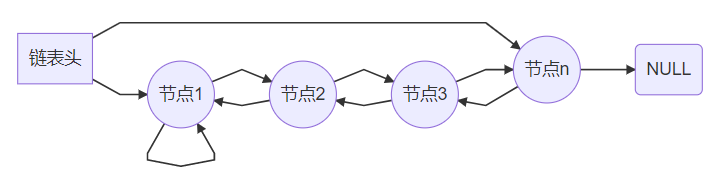
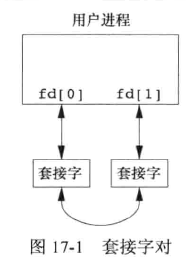

# TAILQ链表

`TAILQ`队列是`FreeBSD`内核中的一种队列数据结构，主要是把队列头抽象成一个单独的结构体。它实现在`Linux queue`中。

可以`include <sys/queue.h>`后直接使用。queue 分为 SLIST、LIST、STAILQ、TAILQ、CIRCLEQ 。queue 的所有源码都是宏定义，因此完全包含于queue.h当中，无需编译为库文件。

TAILQ相关的宏定义主要有如下几个：

```c
TAILQ_HEAD 定义队列头
TAILQ_ENTRY 队列实体定义
TAILQ_INIT 初始化队列
TAILQ_FOREACH 对队列进行遍历操作
TAILQ_INSERT_BEFORE 在指定元素之前插入元素
TAILQ_INSERT_TAIL 在队列尾部插入元素
TAILQ_EMPTY 检查队列是否为空
TAILQ_REMOVE 从队列中移除元素
```

TAILT双向尾链表：




Test


test


# Linux进程伪装

我们知道/proc/pid目录下记录了进程的很多信息，比如`/proc/pid/cmdline`是进程启动时的命令行、`/proc/pid/exe`是一个软连接指向了该进程可执行ELF、`/proc/pid/cwd`是一个软连接指向了进程运行的当前路径等等。
为监控查杀恶意进程，主动防御软件在一个进程在启动时，会记录该进程ID、命令行、可执行ELF路径等。其中进程ID、命令行都可以非常容易的动态修改，这里直接给出代码，网上资料很多，细节不再赘述

```c
int main(int argc, char * argv[])
{
    setproctitle_init(argc, argv, environ);
    setproctitle("[sshd]");
    ...
}
```

以上代码将进程名修改为[sshd]。变换进程ID代码就更加简单.

```c
//fork 返回值为0，表示是子进程；返回值大于0，父进程；小于0，错误
if（fork() > 0) exit(0);
```

父进程退出，子进程继续，进程ID改变、逻辑不变。

[参考资料](https://xz.aliyun.com/t/10235?time__1311=Cqjx2DcDBA0QGQD%2FD0e%3DwyjGYND%3D%3DKDg7oD)

#  安全强化利器：libseccomp

- 项目简介

  是一个开源库，它为 Linux 系统提供了一种强大的安全增强工具——Seccomp（Secure Computing）。该项目的目标是使应用能够限制自身或者特定进程的系统调用行为，从而减少攻击面，提高系统的安全性。

- 技术分析

  Seccomp 是 Linux 内核提供的一个功能，允许程序设定一套规则，筛选出哪些系统调用可以被执行，哪些将被阻止。这种机制对于防止恶意代码和零日攻击非常有效。而 libseccomp 则是 Seccomp 的用户空间接口，提供了高级别的 API 和工具，使得开发者无需深入内核编程就能利用这一特性。

# socketpair机制

socketpair用于创建一对相互连接的unnamed socket。而pipe系统调用使用创建的pipe也是相互连接的unnamed pipe(无名管道)。而pipe和socketpair创建的描述符之间的区别就是:  pipe创建的描述符一端只能用于读，一端用于写，而socketpair创建的描述符任意一端既可以读也可以写。



# libevent

Libevent 事件状态
Libevent 有 4 种事件状态，分别是：已初始化（initialized）、待决（pending）、激活（active）、持久的（persistent），这 4 种状态的转换关系如下图所示：


下面比照上图，对这 4 种状态进行说明：

- 已初始化（initialized）：此状态对应图中的 non-pending 状态，表示事件已经新建完成，但是还未添加到 Libevent 队列中。有 4 条路径可以让事件跳转到此状态：
  - 调用 event_new 函数，返回一个事件对象，或调用 event_assign 赋值一个事件对象。这两个函数本质是一样的，一个是返回事件对象，一个是作为参数传递事件对象，一般第一种用的多。这两个函数在 Libevent 中的定义如下
  - pinding 状态的事件调用 event_del 函数后，也会返回到此状态；
  - active 状态的事件调用完成（即执行完事件回调函数），若没有定义持久化，也会返回到此状态。

```c
struct event *event_new(
    struct event_base *, evutil_socket_t, short, event_callback_fn, void *);

int event_assign(struct event *, 
    struct event_base *, evutil_socket_t, short, event_callback_fn, void *);

// 回调函数指针定义
typedef void (*event_callback_fn)(evutil_socket_t, short, void *);
```

- 待决（pending）：此状态表示事件已经位于 Libevent 队列中，可以随时准备执行。有 4 条路径可以让事件跳转到此状态：
  - 调用 event_add 之后，事件进入到此状态；
  - active 状态的事件调用完成（即执行完事件回调函数），若定义为持久化，也会返回到此状态。

- 激活（active）：此状态表示事件正在执行中，也包括超时事件。这是由 Libevent 进行调度的，用户也可以手动调用 event_active 函数让事件转为此状态。

- 持久的（persistent）：严格来讲，这应该是一个事件表示，这个标识非常重要，会让事件跳转到不同的状态，所以单独进行说明。从图中可以看出：
  - 若设置为持久化，事件完成后状态会由 active 变为 pending ，可仍由 Libevent 调用，不用做其他操作；
  - 若未设置，则表示事件完成后状态会由 active 变为 non-pending ，即初始化状态，此时需要再次调用 event_add 函数，将事件变为 pending 状态，事件才会再次被执行。
