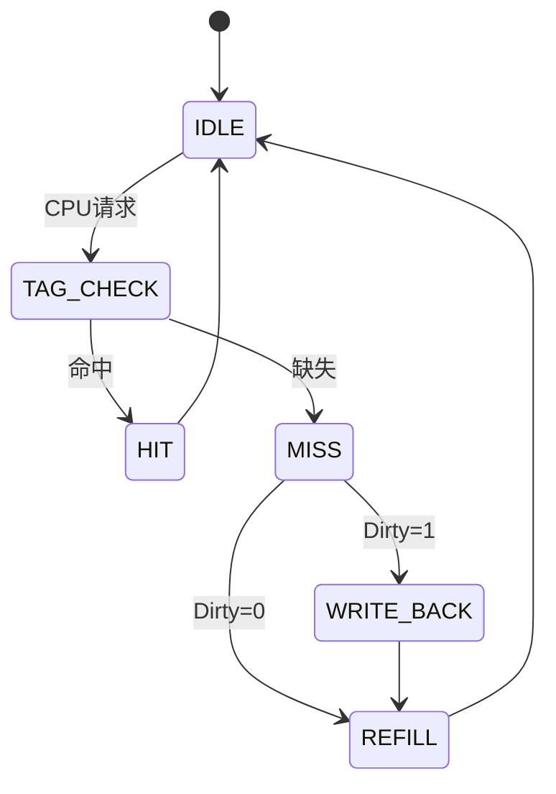

# 简单Cache控制器的有限状态机（FSM）分步详解

## 1. Cache控制器的核心功能
- **处理CPU请求**（读/写内存数据）
- **检查Cache命中（Hit）或缺失（Miss）**
- **管理数据替换**（若Cache已满且发生Miss）
- **维护数据一致性**（如写回策略）

## 2. 有限状态机（FSM）的关键状态

| 状态          | 说明                                                                 |
|---------------|----------------------------------------------------------------------|
| **IDLE**      | 空闲状态，等待CPU请求                                               |
| **TAG_CHECK** | 检查请求地址是否在Cache中（比对Tag）                                |
| **HIT**       | Cache命中，直接返回数据（读）或更新Cache（写）                      |
| **MISS**      | Cache缺失，需从主存加载数据                                         |
| **WRITE_BACK**| 若被替换的Cache行是脏数据（Dirty），需先写回主存                   |
| **REFILL**    | 从主存加载数据到Cache，并更新Tag和Valid位                          |

## 3. 状态转换流程（分步骤）

### 步骤1：IDLE → TAG_CHECK
- **触发条件**：CPU发出读/写请求
- **操作**：
  1. 解析请求地址，提取Tag/Index/Offset
  2. 根据Index找到对应Cache行
  3. 进入`TAG_CHECK`状态

### 步骤2：TAG_CHECK → HIT 或 MISS
- **命中条件**：
  - Tag匹配且Valid=1
  - **命中操作**：返回数据 → 回到`IDLE`
- **缺失条件**：
  - Tag不匹配或Valid=0
  - **缺失操作**：
    - Dirty=1 → 进入`WRITE_BACK`
    - Dirty=0 → 进入`REFILL`

### 步骤3：MISS → WRITE_BACK（可选）
- **操作**：
  1. 将脏数据写回主存
  2. 清除Dirty位
  3. 进入`REFILL`

### 步骤4：REFILL（数据填充）
- **操作**：
  1. 从主存加载数据
  2. 更新Tag和Valid位
  3. 返回数据（读操作）
  4. 回到`IDLE`

## 4. 状态转换图（Mermaid语法）

## 5. 关键信号与寄存器
|信号/寄存器|	作用|
|-----|---|
Tag Array	存储Cache行的标签
Data Array	存储Cache数据
Valid Bit	标记数据有效性
Dirty Bit	标记数据是否被修改
CPU_Request	CPU读/写请求信号
Hit/Miss	输出命中/缺失状态

## 6. 完整示例场景
初始状态：

- Cache行0: Tag=0xAB, Valid=1, Dirty=1, Data="OldData"
- CPU请求：读Tag=0xCD（缺失）

执行流程：

- IDLE → TAG_CHECK（检测到请求）
- TAG_CHECK → MISS（Tag不匹配）
- MISS → WRITE_BACK（Dirty=1需写回）
- WRITE_BACK → REFILL（加载新数据）
- REFILL → IDLE（完成）

## 7. 优化变种
写直达（Write-through）：无需WRITE_BACK状态

多级Cache：需协调L1/L2 Cache状态机

总结：通过状态机明确分离控制逻辑，确保Cache操作的可预测性和高效性。